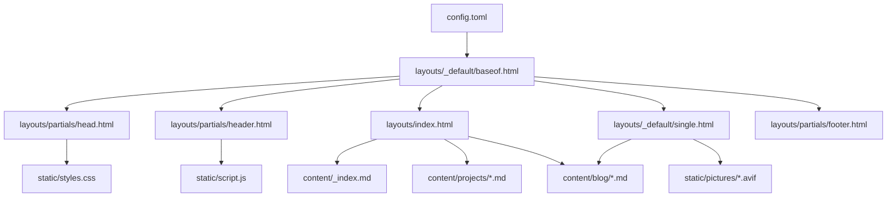

# Hugo Conversion Plan

## Overview
Convert the retro pixel-art portfolio website from static HTML/CSS/JS to a Hugo static site generator for GitHub Pages deployment, preserving all existing content and functionality.

## Hugo Directory Structure

```
lphin0.github.io/
├── archetypes/
│   ├── blog.md          # Template for new blog posts
│   └── project.md       # Template for new projects
├── content/
│   ├── _index.md        # Homepage content (about section)
│   ├── blog/
│   │   └── 2026-01-01-welcome-to-my-blog.md
│   └── projects/
│       ├── project-one.md
│       ├── project-two.md
│       ├── project-three.md
│       └── project-four.md
├── layouts/
│   ├── _default/
│   │   ├── baseof.html  # Base HTML template
│   │   └── single.html  # Blog post template
│   ├── index.html       # Homepage template
│   └── partials/
│       ├── head.html    # Meta tags and CSS
│       ├── header.html  # Navigation bar
│       ├── footer.html  # Footer
│       └── pagination.html # Pagination component
├── static/
│   ├── styles.css
│   ├── script.js
│   └── pictures/
│       └── 2026-01-01-1.avif
├── config.toml          # Site configuration
├── .gitignore
└── README.md
```

## Template Architecture



## Key Conversion Tasks

### 1. Site Configuration (config.toml)
- Set baseURL for GitHub Pages
- Configure site title and description
- Set pagination limits (3 for blog, 2 for projects)
- Define theme parameters (colors, social links)

### 2. Template Structure
- **baseof.html**: HTML skeleton with partial includes
- **head.html**: Meta tags, Open Graph, Twitter Card, CSS link
- **header.html**: Navigation bar with mobile menu
- **footer.html**: Footer content
- **index.html**: Homepage with all sections
- **single.html**: Blog post page template
- **pagination.html**: Reusable pagination component

### 3. Content Migration
- Convert about section to markdown in `content/_index.md`
- Convert 4 projects to markdown files in `content/projects/`
- Convert blog post to markdown in `content/blog/`
- Preserve image in `static/pictures/`

### 4. Front Matter Structure

**Blog Post (TOML):**
```toml
title = "Welcome to My Blog"
date = 2026-01-01
summary = "This is my first blog post..."
```

**Project (TOML):**
```toml
title = "Project One"
description = "Lorem ipsum dolor sit amet..."
```

### 5. Hugo Features to Implement
- Hugo pagination for blog and projects sections
- Hugo template variables for dynamic content
- Hugo range loops for iterating through content
- Hugo date formatting for blog posts
- Hugo URL generation for links
- Hugo image resource handling

### 6. GitHub Pages Deployment
- Set `publishDir = "public"` in config.toml
- Configure `baseURL = "https://lphin.github.io/"`
- Create GitHub Actions workflow or use GitHub Pages from main branch
- Add `.gitignore` for Hugo build artifacts

### 7. Testing Checklist
- [ ] Homepage renders correctly
- [ ] About section displays content
- [ ] Projects grid shows all projects with pagination
- [ ] Blog list shows posts with pagination
- [ ] Blog post page renders with date, title, summary, content
- [ ] Images load correctly in blog posts
- [ ] Mobile menu toggles properly
- [ ] Smooth scrolling works for anchor links
- [ ] Pagination buttons work correctly
- [ ] Open Graph meta tags are generated
- [ ] Twitter Card meta tags are generated
- [ ] All links work correctly

## Preserved Features
- Retro pixel-art theme with 'Press Start 2P' font
- Dark color scheme with CSS variables
- Responsive design (mobile, tablet, desktop)
- Mobile navigation menu
- Smooth scrolling
- Pagination for blog (3 per page) and projects (2 per page)
- Social media meta tags (Open Graph, Twitter Card)
- Blog post images with max-height constraint
- Contact section with social links

## New Hugo Benefits
- Easy content management with markdown files
- Built-in pagination
- Fast static site generation
- Easy deployment to GitHub Pages
- Template reusability
- Content type organization
- Archetypes for quick content creation